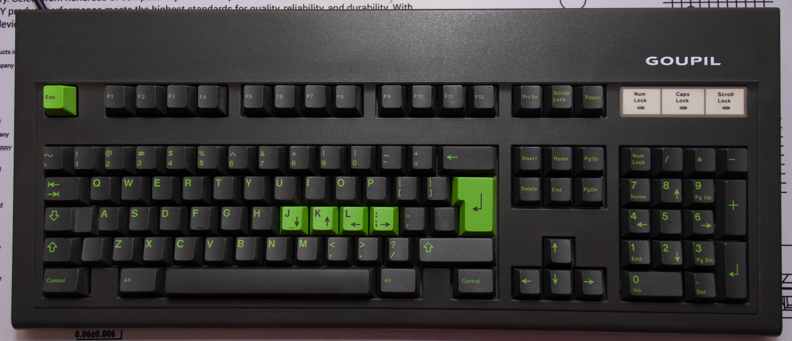
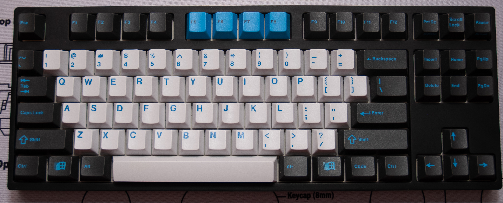

# FAQ

Dislcaimer: К сожалению, у всех разные мнения и вкусы, я постараюсь привести максимально объективную выжимку по каждому вопросу, но тем не менее, здесь будут элементы мнения автора (оно не очень далеко от общего мнения среднего представителя клавиатурного сообщества). Имейте это в виду.
Если у вас будут любые дополнительные вопросы, не стесняйтесь задавать их в нашем чате.

### 1) В чем смысл механических клавиатур?  

Пожалуй, это один самый сложный из всех возможных вопросов
Наверное, каждый решает сам для себя, для чего ему механическая клавиатура, и причину, по которой вам нужна именно механика должны придумать для себя именно вы сами. Сразу хочу заметить одну вещь — мне не удалось ни разу склонить человека к решению покупки механики, пока либо он сам к этому не пришел, либо пока я не подарил её или дал попользоваться на длительный срок. Так что если вы думаете, что найдёте здесь явный ответ на вопрос «нужна ли мне механика?», то, скорее всего, вы его здесь не получите.
Но вернемся обратно. Объективно механическая клавиатура даёт следующие преимущества:

   * Выбрать то, что нравится. Начиная от того, как ведут себя переключатели и какого размера клавиатура, заканчивая цветом корпуса и материала, из которого он выполнен. И в каждом случае вариантов всегда больше чем один
Отсюда также вытекает следующий пункт:

   * Огромный потенциал к кастомизации. Дело в том, что большинство компонентов механических клавиатур достаточно сильно стандартизировано. Вы можете снять клавишу с любой другой механической клавиатуры и с практически стопроцентной вероятностью она без проблем встанет на вашу клавиатуру.

   * Высокая надежность  
Ресурс механических переключателей очень высок, но не стоит рассматривать это как серьёзный аргумент в пользу покупки какой-то клавиатуры, на практике это никак не сказывается на долговечности. Здесь надежность связана с простотой конструкции, её отказоустойчивостью и относительно простым ремонтом.

Это лишь малая доля того, чем может потенциально привлечь вас в мир механических клавиатур.

### 2) Хорошо, мне нужна механика. Какую мне взять?  

Коротко: лучшее соотношение цена/качество на рынке в данный момент это Anne Pro 2, особенно, если поймать ее на распродаже/групбае.

Самые дешевые клавиатуры, которые можно взять: James Donkey, Motospeed.

Бренды которые сообщество рекомендует:
Varmilo, Vortex, Ducky, Leopold, Cooler Master.

Из китайских брендов:
Drevo, Obins, Ikbc, Plum, Durgod.

Если ваc по какой-то причине не устраивает данная клавиатура, то нужно понимать несколько вещей:

   * Все крупные игровые бренды предлагают очень плохое соотношение цена/качество. Они объективно проигрывают абсолютно по всем показателям у менее популярных производителей, их стоит рассматривать в последнюю очередь.
   Не говоря уже про маркетинговую чепуху вроде NKRO, заоблачных пуллинг рейтов и прочих фич, которые на самом деле есть в каждой механической клавиатуре.

   * Хорошей (новой) механической клавиатуры до 3 500 рублей, к сожалению, не бывает.

   * Переключатели Cherry давно стали аутсайдерами. Не стоит рассматривать китайские клоны как плохие, особенно все Gateron и новые Kailh (Box и Speed).

### 3) Как я могу понять, какие переключатели мне подходят?
Лучший способ понять — попробовать. В идеале — на клавиатуре.  

Их можно найти у крупных ретейлерах в точках продаж. Если этого в вашем городе нет, то можно заказать свичтестер. Небольшую стойку с несколькими переключателями, где вы сможете понять что вас привлекает. Но к сожалению, данный способ не передает полностью все ощущения от переключателей, и на клавиатуре они всегда будут ощущаться немного по-другому (в основном, за счет того, что вы нажимаете всеми пальцами, а не только одним).

Важно понимать, что не бывает переключателей, которые подходят лучше для набора текста, когда другие больше подходят для игр.
Все это разнообразие в мире механических клавиатурах нужно только для одного — **выбрать то, что нравится**, и переключатели вам нужно выбрать те, **что вам нравятся**. Иначе какой в этом смысл?

### 4) Какие раскладки бывают и какие в них разница?

Раскладки — некие стандарты количества клавиш на клавиатуре и их расположения.

Самые распространённые из них:

#### Fullsize

*108 Клавиш. Полноразмерная раскладка, где есть и цифровой блок (нампад), и F-ряд.*
  

#### TKL

*90 Клавиш. Из раскладки убран цифровой блок.*
  
#### 75%

75 Клавиш. Убраны некоторые клавиши из навигационного блока

#### 68

68 Клавиш. Точно такая же, как и 75 только без F-ряда

#### 60%

60 Клавиш. Из раскладки убраны навигационный блок и F-ряд.

#### 40%

40 Клавиш. Убран цифровой ряд.

Очевидно, что все эти раскладки отличаются лишь тем, что в них нет/есть определённые группы клавиш.  
Но так же внутри одной раскладки могут быть небольшие отличия.
Например, в игровых клавиатурах нижний ряд не фиксированный, клавиши Alt, Ctrl, и Win могут отличаться по размеру от распространённых стандартов, из за этого на них очень сложно найти клавиши на замену.

Может быть несколько причин, по которым вы захотите купить неполноразмерную клавиатуру:

* Сэкономить место на столе. Особенно это актуально при переходе с Fullsize на TKL, пространства для мыши становиться заметно больше. Так же это касается тех случаев, когда стол небольшой и разместить всё на нем невозможно.

* Вы не пользуетесь этими клавишами. Обычно это касается цифрового блока, либо навигационных клавиш. Когда вы в последний раз осознанно нажимали Scroll Lock?

* Компактность при переноске. Маленькую клавиатуру проще носить с собой. Если вы носите клавиатуру из дома на работу каждый день, то чем будет она меньше — тем лучше.
