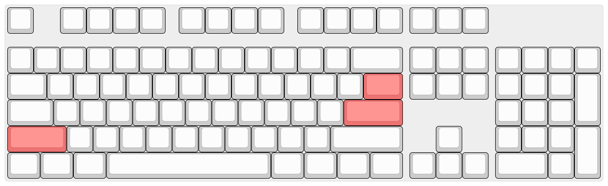
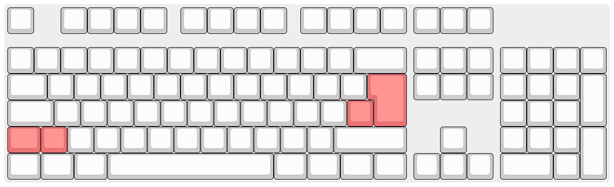
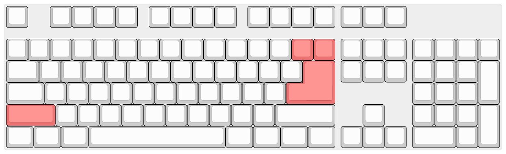
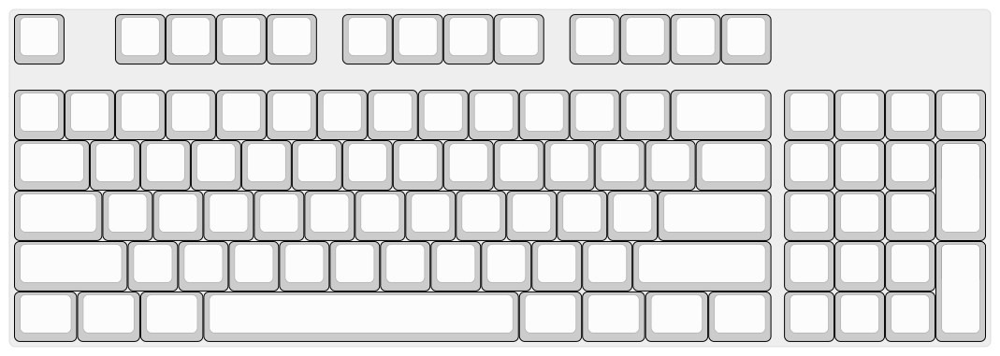
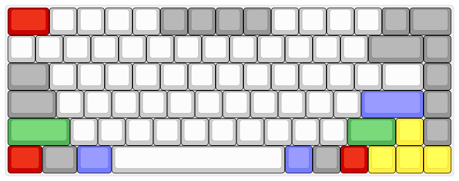
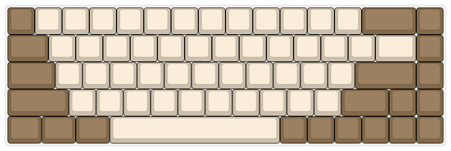
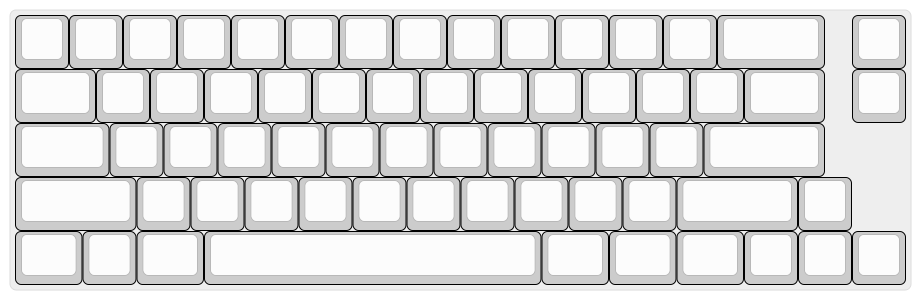
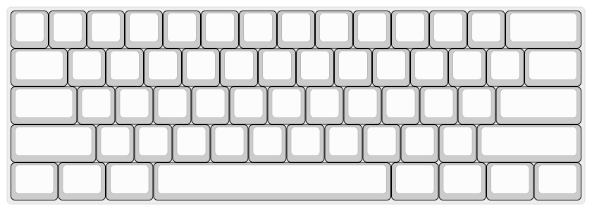
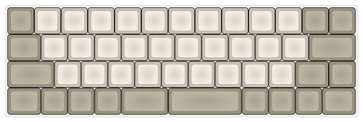
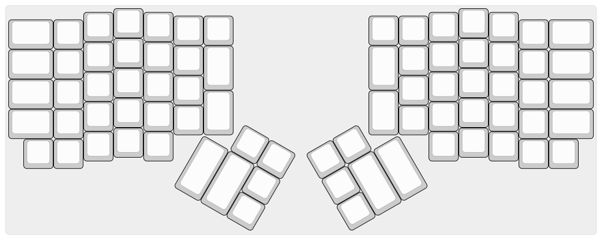

# FAQ

## Предисловие
Мнения и вкусы у всех разные. В данной статье мы постарались привести максимально объективную выжимку по каждому вопросу, но тем не менее, здесь будут фрагменты личного мнения авторов.
Если у вас возникнут любые дополнительные вопросы, не стесняйтесь задавать их в наши [Telegram](https://t.me/ru_mechcult) и [Discord](https://discord.gg/RFSjmV9).

## Что такое механическая клавиатура?
Широко распространённые недорогие клавиатуры устроены достаточно просто. Клавиша давит через резиновый купол на мембрану, состоящую из двух слоёв с дорожками и контактными площадками и промежуточного слоя, изолирующего дорожки верхнего и нижнего слоёв друг от друга. В самых дешёвых клавиатурах может применятся однослойная мембрана. Подобная конструкция недорога в производстве, но имеет ряд недостатков:

* Для срабатывания клавишу необходимо нажимать до упора, что способствует быстрой утомляемости при продолжительной работе с клавиатурой.
* Резиновые купола со временем изнашиваются, теряя эластичность. Клавиши теряют тактильность, приходится прилагать большее усилие для срабатывания.
* Изнашивается мембрана, токопроводящие дорожки и площадки на ней окисляются. Большинство мембранных клавиатур отличаются крайне низкой ремонтопригодностью.

Сейчас, в большинстве случаев, под механической клавиатурой подразумевается устройство на базе дискретных переключателей, состоящих из корпуса и подпружиненного штока, нажатие на который обеспечивает замыкание металлической контактной пары или срабатывание бесконтактного датчика (оптического, магнитного, емкостного).

Есть несколько исключений. Во-первых, это емкостные клавиатуры на базе переключателей Topre (клавиатуры Realforce, HHKB и «китайские Topre» в клавиатурах Plum). Под клавишами в таких клавиатурах расположены резиновые купола, обеспечивающие тактильность, но вместо замыкания контактов контроллер измеряет изменение ёмкости между контактными площадками на печатной плате, что помимо надёжности обеспечивает главное свойство механических клавиатур — срабатывание клавиши без необходимости нажатия до упора.

Ещё одно исключение — механизм buckling spring over membrane, встречающийся в клавиатурах IBM Model M и Unicomp. В этих клавиатурах используется обычная трёхслойная мембрана, но на контактные площадки нажимает ударник, к которому под углом присоединена пружина. При нажатии клавиши усилие возрастает до тех пор, пока пружина резко не сложится внутри направляющей, толкая ударник.

## Зачем нужны механические клавиатуры?
Наверное, каждый решает сам для себя, для чего ему механическая клавиатура, и причину, по которой вам нужна именно механика должны придумать для себя именно вы сами. Убедить человека в необходимости покупки механики удаётся крайне редко, практически единственным работающим аргументом является возможность попробовать клавиатуру в работе.
Тем не менее, можно перечислить несколько преимуществ механических клавиатур:

 * Эргономика. Механизм работы переключателей обеспечивает большее удобство при наборе — клавишу не нужно продавливать до упора.
 * Форм-фактор. Возможность выбрать то, что нравится лично вам: характеристики переключателей (в том числе под разные клавиши), размер, цвет и материал из которого выполнены клавиши и корпус. Большая часть основных компонентов современных клавиатур (переключатели, [клавиши](keycaps.md), [стабилизаторы](stabs.md)) стандартизированы, что открывает широкие возможности по доработке готовых продуктов и созданию уникальных клавиатур.
 * Высокая надежность. Ресурс механических переключателей очень высок, но не стоит рассматривать это как серьёзный аргумент в пользу покупки какой-то клавиатуры, на практике это никак не сказывается на долговечности. Здесь надежность связана с простотой конструкции, её отказоустойчивостью и ремонтопригодностью. Качественная резиномембранная клавиатура может прослужить дольше, чем дешёвая механика с Aliexpress (или даже недешёвая от геймерских брендов), но практически любую неисправность механической клавиатуры можно устранить.

## Хорошо, мне нужна механика. Какую мне взять?
Если вы определились с выбором форм-фактора и переключателей, то быстрее и проще будет [купить](shops.md) готовую клавиатуру, среди которых можно выделить несколько категорий:
* Дорогие игровые клавиатуры Hyper-X, Razer, Corsair, Logitech, Thermaltake, Lenovo и других брендов. Встретить эти клавиатуры можно во многих сетевых магазинах электроники. Соотношение цена/качество у них, как правило, невысокое. Крашеные клавиши, быстро теряющие товарный вид, нестандартный нижний ряд клавиш, аляповатый дизайн, ужасный софт.
Маркетинговую чепуху вроде обязательной необходимости NKRO, заоблачной частоты опроса и прочих фич не стоит воспринимать всерьёз. Практически любая современная механическая клавиатура обеспечивает минимум 6KRO, частота опроса на практике значения не имеет.
* Дешёвые китайские клавиатуры: James Donkey, Rantopad, Motospeed, Teamwolf. В большинстве случаев сборка оставляет желать лучшего: скрипящие корпуса, гремящие стабилизаторы, плохая пайка. Конечно, они будут лучше, чем мембранные клавиатуры до 1000 рублей и при жёстком ограничении по бюджету их можно рассматривать, тут вы хотя бы не переплатите за бренд.
* Середнячки: iKBC, Cooler Master, Obins, Ducky. Пожалуй, лучшие клавиатуры в соотношении цена/качество. Очень заметный скачок по качеству с предыдущей категорией. Они проигрывают топовым брендам, но как правило, отставание не так уж и велико и в основном сводится к чуть худшим стабилизаторам, материалам кейкапов и корпуса и ограниченной программируемости.
* High-End клавиатуры от ведущих брендов: Varmilo, Vortex, Leopold, Filco, Das, Realforce. Они объединяют в себе превосходные материалы и высочайшее качество сборки, и, как правило, целый вагон полезных функций, таких как полная программируемость или наличие нескольких профилей для работы с разными устройствами.
* Экзотика. Соотношение цена/качество падает за счёт наценки за культовость или необычный форм-фактор. Примеры: HHKB (известная 60%-клавиатура на Topre), Kinesis Advantage и Maltron (эргономичные клавиатуры).
* Комплекты для сборки (DIY kits). Почти готовые клавиатуры, требующие умения работать с паяльником. От недорогих 60% в пластиковых корпусах ценой менее $100 до уникальных мелкосерийных клавиатур. Комплект стоит рассматривать в том случае, если вам не хватает уровня кастомизации, предлагаемой производителями готовых клавиатур, и нужны: [полная программируемость](QMK.md), свободный выбор переключателей (или даже совмещение нескольких типов переключателей в одной клавиатуре), [клавиш](keycaps.md) и корпусов. Как правило, продавцы комплектов предлагают услугу по сборке клавиатуры — хороший вариант для тех, кто не уверен в собственных силах и хочет избежать возможных проблем с совместимость.
* Полностью самодельные клавиатуры. При наличии необходимых навыков вы можете спроектировать собственную клавиатуру с нуля: нарисовать раскладку, изготовить корпус (например, лазерной резкой из акрила), печатную плату, модифицировать одну из существующих прошивок.

Коротко: лучшее соотношение цена/качество на рынке в данный момент – это Anne Pro 2, особенно если поймать её на распродаже/групбае. Неплохим вариантом станут клавиатуры из линейки Masterkeys от Cooler Master.

## Какие переключатели мне подходят?
Лучший способ понять — попробовать. В идеале — на клавиатуре, но полезно будет знать немного теории.

### Основные типы и характеристики переключателей

* **Кликающие**. Именно с ними в первую очередь у большинства ассоциируются механические клавиатуры. В большинстве современных модульных переключателей за клик отвечает специальный выступ на штоке, давящий на упругую пластину. Усилие сначала нарастает линейно, затем выступ начинает давить на кликер и усилие возрастает с большей скоростью, затем кликер срабатывает (во многих конструкциях пластина ударяет о корпус переключателя), замыкается контактная пара и усилие снижается, так как выступ уже прошёл через кликер. При нажатии на клавишу с кликающим переключателем пользователь получает звуковую и тактильную отдачу, чувствуя по «бугорку», что клавиша сработала. Можно достаточно быстро научится чувствовать момент срабатывания и не продавливать клавиши до упора, что существенно снизит утомляемости при продолжительной работе.
В зависимости от конкретной реализации механизма, кликающий переключатель может щёлкать либо только на прямом ходе, либо дважды — на прямом и обратном. Множество пользователей считают кликающие переключатели наиболее удобными для набора текста, но у них есть существенный недостаток — шум, который может раздражать окружающих.
Самые известные кликающие переключатели: Cherry MX Blue и различные клоны Cherry MX производства Gateron, Kailh, Outemu и др. К ним же относятся и buckling spring, выделяющиеся тем, что момент срабатывания точно совпадает с кликом, так как за замыкание, тактильность и клик отвечает один и тот же простой механизм, состоящий из пружины и ударника.

* **Тактильные**. Если немного изменить конструкцию переключателя — так, чтобы пластина не ударяла о корпус, то мы получим тактильный переключатель без щелчка. К тактильным переключателям относятся и резиновые купола даже в простейших резино-мембранных клавиатурах, но основная цель тактильности — не продавливать клавиши до упора будет достигнута только с механическими переключателями или емкостными. Важной характеристикой простых тактильных и кликающих переключателей является уровень их тактильности. Недостаточная тактильность будет плохо восприниматься, чрезмерная тактильность в виде жёсткой ступеньки будет утомлять при продолжительном наборе.
Распространённые тактильные переключатели — Cherry MX Brown и клоны, Topre.

* **Линейные**. Всё просто — пружина сжимается, усилие плавно нарастает, ближе к концу хода происходит замыкание контактов. Линейные переключатели нравятся геймерам (тактильность, как правило, им только мешает) и тем, кому просто не нравятся тактильные переключатели.

Немаловажную роль играет жёсткость пружины, используемой в переключателях. Идеала, подходящего всем, не существует. При слишком лёгких для вас пружинах переключатели будут срабатывать от случайных прикосновений, появится много опечаток, «поймать» тактильность будет гораздо тяжелее и будет много нежелательных нажатий до упора.

Клавиатуры можно найти у крупных ритейлеров. Если их в вашем городе нет, то можно заказать свичтестер — небольшой корпус с несколькими переключателями разных типов. Но к сожалению, использование свичтестера не передает полностью все ощущения от переключателей и на клавиатуре они всегда будут ощущаться немного по-другому (в основном, за счет того, что вы нажимаете всеми пальцами, а не только одним).

Важно понимать, что не бывает переключателей, которые подходят лучше для набора текста, а другие больше подходят для игр.
Все это разнообразие в мире механических клавиатурах нужно только для одного — **выбрать то, что нравится**, и переключатели вам нужно выбрать те, **что вам нравятся**. Иначе какой в этом смысл?

### Правда ли что переключатели Cherry лучше китайских клонов?
На этот вопрос нет однозначного ответа.
* Ещё года три назад можно было сказать, что Cherry гораздо надёжнее, чем аналоги. Следует осторожно относиться к покупке старых клавиатур на переключателях Kailh и Outemu — было много жалоб на низкий ресурс, переключатели теряли клик, начинали двоить и т. п. При этом Cherry тоже были далеки от идеала — плавность линейных переключателей Cherry постепенно падала с середины 1990-х годов и энтузиасты начали ценить т.н. «винтажные Cherry MX Black», переключатели, выпущенные в 1980-х — начале 1990-х.
* Со временем конкуренция заставила практически всех известных производителей улучшить качество, расширить ассортимент и снизить цены. В настоящее время достойной заменой Cherry являются переключатели Gateron и производимые им же Zealio. Интересные в плане характеристик переключатели выпускает Kaihua (например, Kailh Box). У Outemu долго были нарекания по качеству, но их репутация постепенно улучшается. Cherry тоже исправился — в 2017 году появились переключатели, изготовленные на новом оборудовании, почти все проблемы с плавностью хода удалось устранить.

### Почему переключатели Cherry MX стали стандартом индустрии?
Компания Cherry имела и имеет ряд [патентов](https://deskthority.net/wiki/Keyboard_patents), считается что истечение в 2003 году [US4467160](https://patents.google.com/patent/US4467160) спровоцировало наводнение рынка клонами Cherry MX от Kailh, Razer, Outemu, Greetech, Zoro, Gateron, Zealio и других производителей. Некоторые полагают что патент протух в 2013 или 2014 году, после чего выставке CES 2014 компания Razer анонсировала свои переключатели, но нет, [20 лет](https://www.quora.com/Why-do-patents-expire-How-are-they-renewed) от [даты регистрации](http://www.bpmlegal.com/howtoterm.html). Интересно что на сайте ведомства США по патентам и товарным знакам значится что за патент [не платили взносы](https://portal.uspto.gov/pair/PublicPair), поэтому он перестал действовать 08/21/1988, но скорее всего, это ошибка.
Почему все делали клоны черри? Потому что китайцы хороши в копировании, но не в изобретении?
Так же есть мнение, что в 2014-2015 годах производители клавиатур стали выбирать переключатели других производителей, потому что Cherry не справлялись с объёмами производства, а не из-за дороговизны.
Считается что Cherry не снижали цену на переключатели даже после истечения патента и появления клонов из-за ценности бренда (немецкое качество (с)), затрат на R&D и контроль качества, но последнее [подвергается сомнению](https://flumeded.github.io/ru_mech/#/FAQ?id=%d0%9f%d1%80%d0%b0%d0%b2%d0%b4%d0%b0-%d0%bb%d0%b8-%d1%87%d1%82%d0%be-%d0%bf%d0%b5%d1%80%d0%b5%d0%ba%d0%bb%d1%8e%d1%87%d0%b0%d1%82%d0%b5%d0%bb%d0%b8-cherry-%d0%bb%d1%83%d1%87%d1%88%d0%b5-%d0%ba%d0%b8%d1%82%d0%b0%d0%b9%d1%81%d0%ba%d0%b8%d1%85-%d0%ba%d0%bb%d0%be%d0%bd%d0%be%d0%b2).

## Какие раскладки бывают и какие из них удобнее?

Раскладка — стандарт количества клавиш на клавиатуре и их расположения.

Самые распространённые стандартные раскладки:

### Fullsize

Полноразмерная раскладка, где есть цифровой блок (нампад) и F-ряд. Изначально в классической полноразмерной раскладке было 101/102 клавиши (в вариантах ANSI и ISO), позже к ним добавилось ещё три (две GUI и Menu).

*Раскладка ANSI 104:*

### Я привык к большому Enter'у, не хочу ничего менять!
Выше вы видели раскладку ANSI, которая появилась и используется, в основном, в США: горизонтальный Enter, длинный 2,25U левый Shift, backslash на Enter. Основных видов раскладок с «большим Enter» существует два:
* ISO. Используется в большинстве европейских стран. Вертикальный Enter, бэкслеш слева от него, короткий левый Shift с дополнительной клавишей non-US backslash. Никаких объективных преимуществ при использовании стандартной логической раскладки для русского языка у ISO перед ANSI нет, так как non-US backslash выполняет функции обычного backslash, так что выбор в пользу ISO определяется лишь привычкой.
*Раскладка ISO 105:*

* Asian (big ass Enter — «толстозадый Enter»). Enter в виде перевёрнутой «Г», гибрид ANSI и ISO. Места под backslash уже не остаётся, так что его помещают выше, уменьшая Backspace до 1U. В настоящее время подобная раскладка считается экзотикой и в мире механических клавиатур практически не встречается. Даже если вам удастся найти, например, SteelSeries 7g, то вы столкнётесь с невозможностью найти набор клавиш под неё. Переходите на ANSI или ISO.

*Раскладка Asian 104:*

### "Compact fullsize"/90%

Навигационный блок интегрирован в цифровой или навигационные стрелки помещены между изменённым нижним рядом и цифровым блоком.
*Клавиатура Cooler Master Masterkeys PRO M, 92 клавиши*

### TKL/80%

87/88 клавиш. Из раскладки убран цифровой блок.

*Раскладка ANSI TKL*

### 75%

75 клавиш. Переформированный навигационный блок и правая часть нижнего ряда.

*Раскладка Vortex Race 3*

### 65%

65-68 клавиш. Точно такая же, как и 75 только без F-ряда или видоизменённый и перемещённый навигационный блок.

*Раскладка Tada68*

*Раскладка Leopold FC660*

### 60%

61-65 клавиш. Из раскладки убраны навигационный блок и F-ряд.

*Раскладка ANSI 60%*

### 40%

40–50 клавиш. Убран цифровой ряд. Среди таких небольших клавиатур наблюдается большое многообразие.

*Клавиатура Vortex Core, 48 клавиш*

Очевидно, что все эти раскладки отличаются лишь тем, что в них нет/есть определённые группы клавиш, но также внутри одной раскладки могут быть небольшие отличия.
Например, в игровых клавиатурах нижний ряд может быть нестандартным, клавиши Alt, Ctrl, и Win могут отличаться по размеру от классической ANSI/ISO 104/105, что создаёт трудности в поиске совместимых наборов клавиш.

Может быть несколько причин, по которым вы захотите купить неполноразмерную клавиатуру:

* Сэкономить место на столе. Особенно это актуально при переходе с Fullsize на TKL, пространства для мыши становится заметно больше. Так же это касается тех случаев, когда стол небольшой и разместить всё на нем невозможно.

* Вы не пользуетесь этими клавишами. Обычно это касается цифрового блока или навигационных клавиш. Когда вы в последний раз осознанно нажимали Scroll Lock? Даже если цифровой блок вам всё же необходим время от времени, его можно докупить отдельно и расположить в любом месте — слева от клавиатуры или справа от мыши.

* Компактность при переноске. Маленькую клавиатуру проще носить с собой. Если вы носите клавиатуру из дома на работу каждый день, то чем будет она меньше — тем лучше.

### Прочие раскладки
Модульная конструкция позволяет легко создавать любые раскладки, фантазия ограничивается лишь стандартными размерами клавиш. Кто-то располагает цифровой блок слева, другие убирают смещение рядов клавиш (ортолинейные раскладки), существует большое разнообразие эргономичных клавиатур, создатели которых пытались радикально улучшить удобство пользования клавиатурой, располагая клавиши на плоскости (и в пространстве) самым причудливым образом.

*Раскладка Ergodox:*

### Компактная клавиатура — это хорошо, но как вы живёте без F-клавиш, а тем более без стрелочек?
Нужных клавиш вас никто не лишает, просто они расположены в другом слое. С концепцией переключения слоёв знаком каждый, кто пользовался ноутбуком. Практически на любой ноутбучной клавиатуре есть клавиша Fn, при удержании которой клавиши выполняют дополнительные функции. С компактными клавиатурами то же самое. Например, в 60%-клавиатурах F-ряд совмещён с цифровым рядом, стрелки находятся на Fn+WASD или IJKL (любители Vim размещают их в один ряд на HJKL). Использование слоёв, с одной стороны, увеличивает сложность использования клавиатуры за счёт необходимости в дополнительных нажатиях клавиш, с другой — улучшает эргономичность, так как руки перемещаются на меньшие расстояния.
