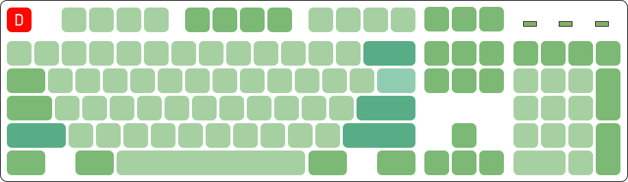

# FAQ

## Предисловие
Мнения и вкусы у всех разные. В данной статье мы постарались привести максимально объективную выжимку по каждому вопросу, но тем не менее, здесь будут фрагменты личного мнения авторов.
Если у вас возникнут любые дополнительные вопросы, не стесняйтесь задавать их в нашем [чате](https://t.me/ru_mechcult).

## Что такое механическая клавиатура?
Широко распространённые недорогие клавиатуры устроены достаточно просто. Клавиша давит через резиновый купол на мембрану, состоящую из двух слоёв с дорожками и контактными площадками и промежуточного слоя, изолирующего дорожки верхнего и нижнего слоёв друг от друга. В самых дешёвых клавиатурах может применятся однослойная мембрана. Подобная конструкция очень дёшева в производстве, но имеет ряд недостатков:

* Для срабатывания клавишу необходимо нажимать до упора, что способствует быстрой утомляемости при продолжительной работе с клавиатурой.
* Резиновые куполы со временем изнашиваются, теряя эластичность. Клавиши теряют тактильность, приходится прилагать большее усилие для срабатывания.
* Изнашивается мембрана, токопроводящие дорожки и площадки на ней окисляются. Большинство мембранных клавиатур отличаются крайне низкой ремонтопригодностью.

Сейчас в большинстве случаев под механической клавиатурой подразумевается устройство на базе дискретных переключателей, состоящих из корпуса и подпружиненного штока, нажатие на который обеспечивает замыкание металлической контактной пары или срабатывание безконтактного датчика (оптического, магнитного, емкостного).

Есть несколько исключений. Во-первых, это емкостные клавиатуры на базе переключателей Topre (клавиатуры Realforce, HHKB и «китайские Topre» в клавиатурах Plum). Под клавишами в таких клавиатурах расположены резиновые куполы, обеспечивающие тактильность, но вместо замыкания контактов контроллер измеряет изменение ёмкости между контактными площадками на печатной плате, что помимо надёжности обеспечивает главное свойство механических клавиатур — срабатывание клавиши без необходимости нажатия до упора.

Ещё одно исключение — механизм buckling spring over membrane, встречающийся в клавиатурах IBM Model M и Unicomp. В этих клавитурах используется обычная трёхслойная мембрана, но на контактные площадки нажимает ударник, к которому под углом присоединена пружина. При нажатии клавиши усилие возрастает до тех пор, пока пружина резко не сложится внутри направляющей, толкая ударник.

## Зачем нужны механические клавиатуры?
Наверное, каждый решает сам для себя, для чего ему механическая клавиатура, и причину, по которой вам нужна именно механика должны придумать для себя именно вы сами. Убедить человека в необходимости покупки механики удаётся крайне редко, практически единственным работающим аргументом является возможность попробовать клавиатуру в работе.
Тем не менее, можно перечислить несколько преимуществ механических клавиатур:

 * Эргономика. Большее удобство при наборе обеспечивают механизм работы переключателей (клавишу не нужно продавливать до упора) и разнообразие форм-факторов.

 * Возможность выбрать то, что нравится лично вам: характеристики переключателей (в том числе под разные клавиши), размер и форм-фактор клавиатуры, цвет и материал, из которого выполнены клавиши и корпус. Большая часть основных компонентов современных клавиатур (переключатели, [клавиши](keycaps.md), [стабилизаторы](stabs.md)) стандартизированы, что открывает широкие возможности по доработке готовых продуктов и созданию уникальных клавиатур.

 * Высокая надежность. Ресурс механических переключателей очень высок, но не стоит рассматривать это как серьёзный аргумент в пользу покупки какой-то клавиатуры, на практике это никак не сказывается на долговечности. Здесь надежность связана с простотой конструкции, её отказоустойчивостью и ремонтопригодностью. Качественная резиномембранная клавиатура может прослужить дольше, чем дешёвая механика с Aliexpress (или даже недешёвая от геймерских брендов), но практически любую неисправность механической клавиатуры можно устранить.

## Хорошо, мне нужна механика. Какую мне взять?  
Коротко: лучшее соотношение цена/качество на рынке в данный момент это Anne Pro 2, особенно если поймать её на распродаже/групбае.

Самые дешёвые клавиатуры, которые можно взять: James Donkey, Motospeed.

Бренды которые сообщество рекомендует: Varmilo, Vortex, Ducky, Leopold, Cooler Master.

Из китайских брендов: Drevo, Obins, Ikbc, Plum, Durgod.

Если ваc по какой-то причине не устраивает продукция вышеперечисленных брендов, то нужно понимать несколько вещей:

   * Все крупные игровые бренды предлагают очень плохое соотношение цена/качество. Они объективно проигрывают абсолютно по всем показателям у менее популярных производителей, их стоит рассматривать в последнюю очередь.
   Не говоря уже про маркетинговую чепуху вроде NKRO, заоблачных пуллинг рейтов и прочих фич, которые на самом деле есть в каждой механической клавиатуре.

   * Хорошей (новой) механической клавиатуры до 3500 рублей, к сожалению, не бывает.

   * Переключатели Cherry давно стали аутсайдерами. Не стоит рассматривать китайские клоны как плохие, особенно все Gateron и новые Kailh (Box и Speed).

## Какие переключатели мне подходят?
Лучший способ понять — попробовать. В идеале — на клавиатуре, но полезно будет знать немного теории.

### Основные типы и характеристики переключателей

* **Кликающие**. Именно с ними в первую очередь у большинства ассоциируются механические клавиатуры. В большинстве современных модульных переключателей за клик отвечают специальный выступ на штоке, давящий на упругую пластину. Усилие сначала нарастает линейно, затем выступ начинает давить на кликер и усилие возрастает с большей скоростью, затем кликер срабатывает (во многих конструкциях пластина ударяет о корпус переключателя), замыкается контактная пара и усилие снижается, так как выступ уже прошёл через кликер. При нажатии на клавишу с кликающим переключателем пользователь получает тактильную отдачу, чувствуя по «бугорку», что клавиша сработала, и звуковую отдачу. Можно достаточно быстро научится чувствовать момент срабатывания и не продавливать клавиши до упора, что существенно снизит утомляемости при продолжительной работе.
В зависимости от конкретной реализации механизма кликающий переключатель может щёлкать либо только на прямом ходе, либо дважды — на прямом и обратном. Множество пользователей считают кликающие переключатели наиболее удобными для набора текста, но у них есть существенный недостаток — шум, который может сильно не понравится окружающим.
Самые известные кликающие переключатели: Cherry MX Blue и различные клоны Cherry MX производства Gateron, Kailh, Outemu и др. К ним же относятся и buckling spring, выделяющихся тем, что момент срабатывания точно совпадает с кликом, так как за замыкание, тактильность и клик отвечает один и тот же простой механизм, состоящий из пружины и ударника.

* **Тактильные**. Если немного изменить конструкцию переключателя — так, чтобы пластина не ударяла о корпус, то мы получим тактильный переключатель без щелчка. К тактильным переключателям относятся и резиновые куполы даже в простейших резино-мембранных клавиатурах, но основная цель тактильности — не продавливать клавиши до упора — будет достигнута только с механическими переключателями или емкостными. Важной характеристикой простых тактильных и кликающих переключателей является уровень их тактильности. Недостаточная тактильность будет плохо восприниматься, чрезмерная тактильность в виже жёсткой ступеньки будет утомлять при продолжительном наборе.
Распространённые тактильные переключатели — Cherry MX Brown и клоны, Topre.

* **Линейные**. Всё просто: пружина сжимается, усилие плавно нарастает, ближе к концу хода происходит замыкание контактов. Линейные переключатели нравятся геймерам (тактильность, как правило, им только мешает) и тем, кому просто не нравится тактильные переключатели.

Немаловажную роль играет жёсткость пружины, используемой в переключателях. Идеала, подходящего для всех, тут не существует. При слишком лёгких для вас пружинах переключатели будут срабатывать от случайных прикосновений, появится много опечаток, «поймать» тактильность будет гораздо тяжелее и будет много нежелательных нажатий до упора.

Клавиатуры можно найти у крупных ритейлеров. Если их в вашем городе нет, то можно заказать свитчтестер — небольшой корпус с несколькими переключателями разных типов. Но к сожалению, использование свитчтестера не передает полностью все ощущения от переключателей, и на клавиатуре они всегда будут ощущаться немного по-другому (в основном, за счет того, что вы нажимаете всеми пальцами, а не только одним).

Важно понимать, что не бывает переключателей, которые подходят лучше для набора текста, когда другие больше подходят для игр.
Все это разнообразие в мире механических клавиатурах нужно только для одного — **выбрать то, что нравится**, и переключатели вам нужно выбрать те, **что вам нравятся**. Иначе какой в этом смысл?

## Какие раскладки бывают и какие в них разница?

Раскладки — стандарты количества клавиш на клавиатуре и их расположения.

Самые распространённые стандартные раскладки:

### Fullsize

*Полноразмерная раскладка, где есть и цифровой блок (нампад), и F-ряд.* Изначально в классической полноразмерной раскладке было 101/102 клавиши (в вариантах ANSI и ISO), позже к ним добавилось ещё три (две GUI и Menu).

### TKL

*90 клавиш. Из раскладки убран цифровой блок.*

### 75%

75 клавиш. Убраны некоторые клавиши из навигационного блока

### 68

68 клавиш. Точно такая же, как и 75 только без F-ряда

### 60%

60 клавиш. Из раскладки убраны навигационный блок и F-ряд.

### 40%

40 клавиш. Убран цифровой ряд.

Очевидно, что все эти раскладки отличаются лишь тем, что в них нет/есть определённые группы клавиш.
Но так же внутри одной раскладки могут быть небольшие отличия.
Например, в игровых клавиатурах нижний ряд не фиксированный, клавиши Alt, Ctrl, и Win могут отличаться по размеру от распространённых стандартов, из за этого на них очень сложно найти клавиши на замену.

Может быть несколько причин, по которым вы захотите купить неполноразмерную клавиатуру:

* Сэкономить место на столе. Особенно это актуально при переходе с Fullsize на TKL, пространства для мыши становиться заметно больше. Так же это касается тех случаев, когда стол небольшой и разместить всё на нем невозможно.

* Вы не пользуетесь этими клавишами. Обычно это касается цифрового блока, либо навигационных клавиш. Когда вы в последний раз осознанно нажимали Scroll Lock?

* Компактность при переноске. Маленькую клавиатуру проще носить с собой. Если вы носите клавиатуру из дома на работу каждый день, то чем будет она меньше — тем лучше.
