# Клавиши (keycaps, кейкапы)
Как неочевидно это бы ни звучало, но клавиши (колпачки/капы/кейкапы) могут очень сильно влиять на ощущения от печати и от клавиатуры в целом. Также профиль клавиш — то, какой они формы и высоты, — может влиять на комфорт, скорость и точность печати.  

У любой клавиши есть три основные характеристики: материал, профиль и метод нанесения символов — они определяют внешний вид и тактильные ощущения. Кратко пройдёмся по всем из них.

## Пластик

В основном существует 3 типа материалов, из которых изготавливают клавиши:  
ABS (Acrylonitrile butadiene styrene) — Акрилонитрилбутадиенстирол  
PBT (Polybutylene terephthalate) — Полибутилентерефталат  
POM (Polyoxymethylene) — Полиформальдегид/полиоксиметилен/полиацеталь

Особняком стоят кейкапы из резины, силикона, дерева и прочего сырья, но встречаются они в основном в виде единичных клавиш или небольших наборов, поэтому их мы затрагивать не будем.

Не обязательно запоминать названия всех полимеров, достаточно знать их акронимы.  

Если очень кратко, то PBT, как правило, лучше ABS, но бывают и исключения.

### ABS
Наиболее распространённый тип материала из которого делают клавиши.

Имеет следующий ряд преимуществ:
* Пластик стоит дешевле.
* Технологии формовки, литья и окраски клавиш проще.
* Можно достичь некоторых визуальных эффектов (например, сделать прозрачную клавишу).

И на этом всё.
Но как раз из-за этих пунктов это — самый распространенный материал для изготовления клавиш, они банально дешевле в производстве.

*Износ клавиш из ABS-пластика (источник — geekhack):*
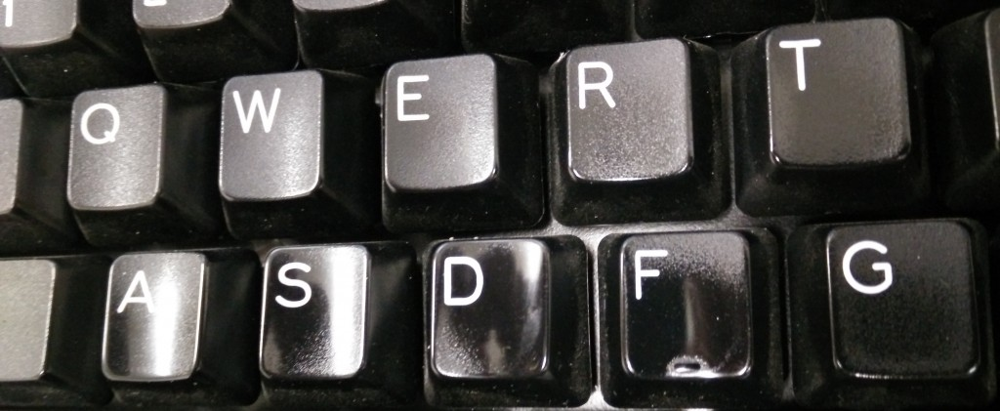

А далее минусы:
* Плотность пластика заметно меньше, чем у PBT (сказывается на ощущениях и звуке при печати).
* Со временем клавиши теряют текстуру (клавиша начинает блестеть, теряет приятную шероховатость).
* Впитывает жиры с пальцев как губка.
* Белые капы желтеют (уже не так, как раньше, но все еще встречается).

### PBT
За редким исключением, клавиши из PBT практически не встречаются на клавиатурах для массового рынка.

Из плюсов:
* Выше плотность пластика — улучшаются звуковые и тактильные характеристики.
* Исключительно устойчивы к механическим повреждениям, перепадам температур и химическому воздействию.

И минусы:
* Значительно сложнее в производстве и, как следствие, их дороже изготавливать, чем ABS.
* Некоторые варианты окраски неосуществимы или осуществимы с ограничениями.

### POM
Очень редкий тип пластика в производстве клавиш, почти не встречается даже в отдельных наборах.

Плюсы:
* Прочность аналогична PBT.
* Не стирается и не впитывает жиры.
* Термостойкость чуть ниже, чем у PBT, но всё равно позволяет ему выдерживать кипящую воду без деформаций.

Минусы:
* Скользкий.
* Окисляется в присутствии хлора в любых концентрациях (даже в простой воде из-под крана).
* При деполимеризации превращается в токсичный формальдегид.
* Ещё меньше вариантов возможной окраски.

Но всегда стоит помнить, что ABS ABS'y рознь. Например, клавиши от компаний SP, Maxkey и GMK — это толстые ABS клавиши с двойным литьём (doubleshot) и их можно перепутать с PBT.
## Профили

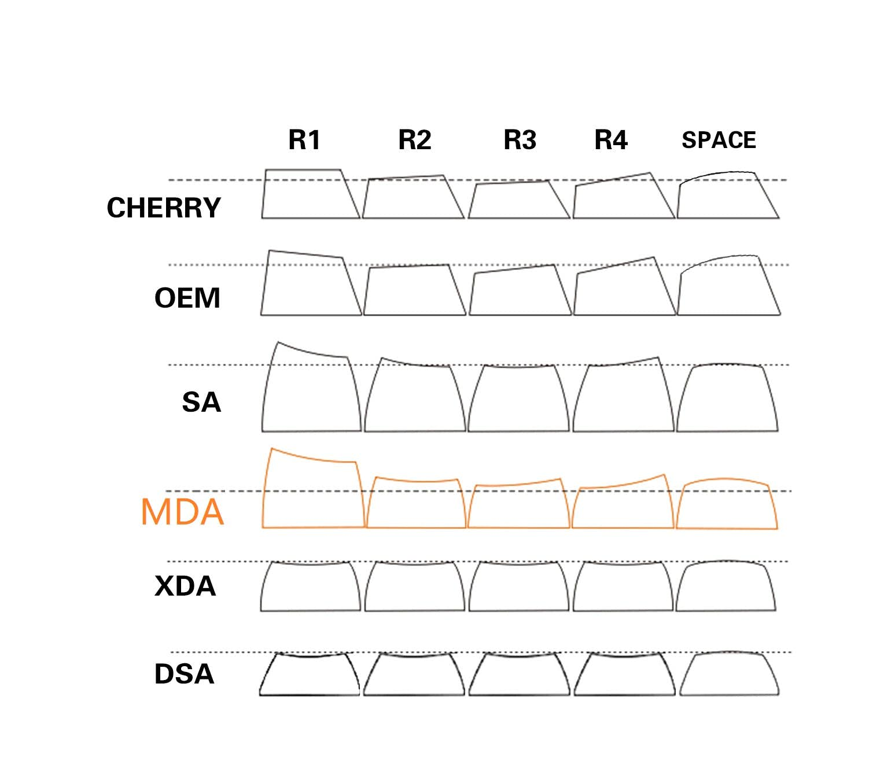

Помимо всего вышеперечисленного, клавиши бывают разных профилей, причём отличия могут быть не только в форме поверхности клавиш (плоская, цилиндрическая, сферическая), но и в высоте, например, когда клавиши одного ряда выше клавиш другого (sculptured profile), или наоборот, когда все клавиши всех рядов одной высоты (uniform profile) — подробнее об этом в следующем разделе.

### OEM
*OEM Pudding Keycaps (фото [Quartz64](https://kbobsession.blogspot.com/) с первого клавиатурного ру-митапа, клавиатура [diimdeep](https://www.reddit.com/user/diimdeep)):*
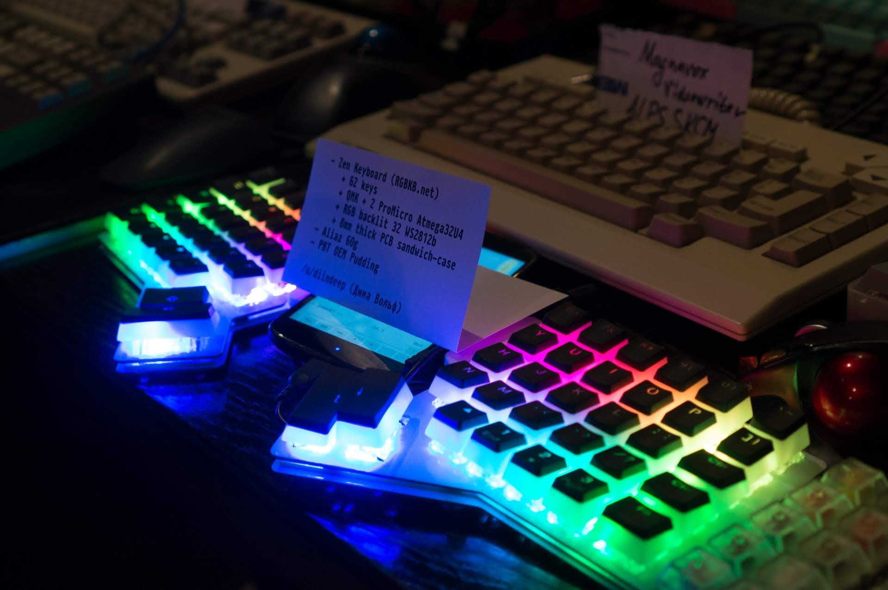
Если у вас сейчас есть механическая клавиатура, то с большой долей вероятности у вас именно этот профиль.
Как таковой профиль ничем не плох, есть разница по высоте, чтобы помогать пальцам находить клавиши, форма клавиш сделана так, чтобы максимально задействовать доступное пространство и по клавишам было легче попадать.

### Cherry
*Набор GMK Carbon (источник — [Reddit](https://www.reddit.com/r/MechanicalKeyboards/comments/7sxygq/sx60_feat_gmk_carbon/)):*
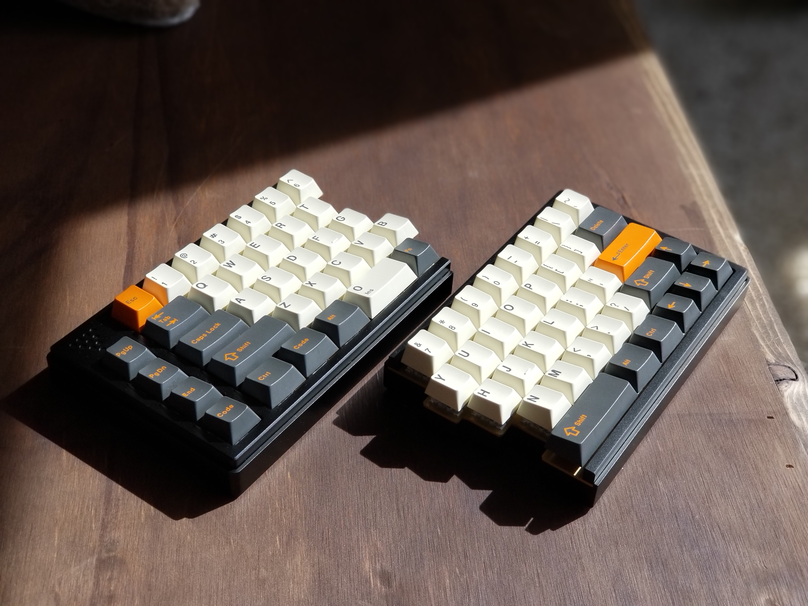
Sculptured-профиль с цилиндрическими выемками на верхней грани клавиш. Поставлялся на всех клавиатурах Cherry, а в данный момент, после выкупа оборудования компанией GMK, выпускается у них. Клавиши в общем и целом очень похожи на OEM, но значительно ниже.

### Tai-Hao Cubic
*Профили Cherry (на переднем плане) и Tai-Hao Cubic (источник — [Keychatter](https://www.keychatter.com/2017/06/29/first-look-tai-hao-cubic-profile/)):*
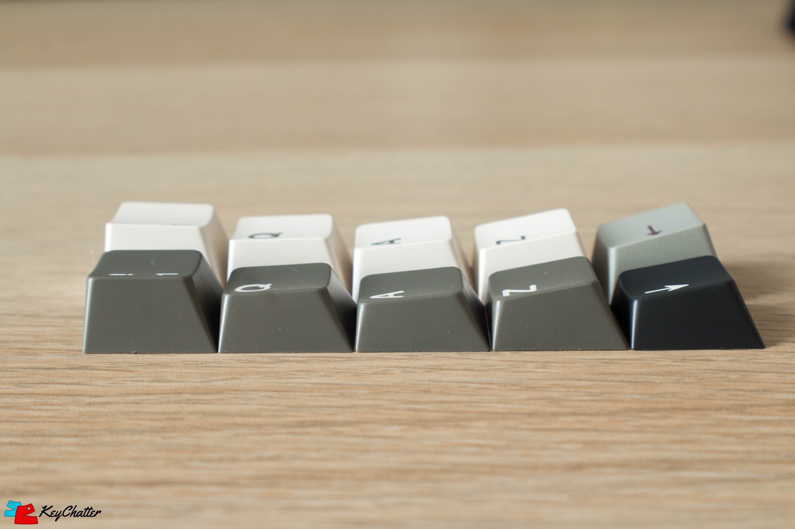
Уникальный профиль компании Tai-Hao. Нечто среднее между Cherry и OEM.

### DCS
*Набор DCS Purple Rain (источник — [TheVan Keyboards](https://thevankeyboards.com/products/dcs-purple-rain)):*
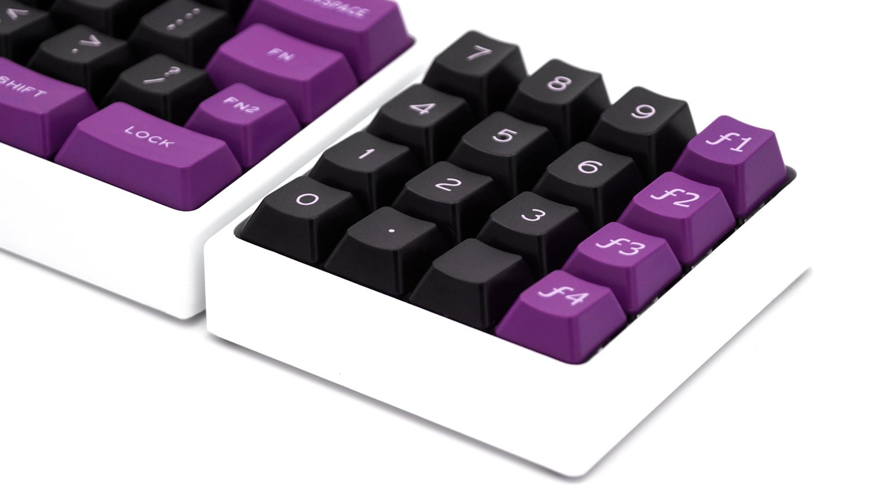

А это — взгляд Signature Plastics на ОЕМ-профиль. Кейкапы этого профиля чуть ниже, чем Cherry, и при этом также имеют цилиндрические форму верхней части клавиши, которая смещена к дальней грани.

### SA
*Набор SA(s) 1965 (источник — [Reddit](https://www.reddit.com/r/MechanicalKeyboards/comments/7qk9wg/photos_xd75re_x_sa_1965_x_npkc_walnut/)):*
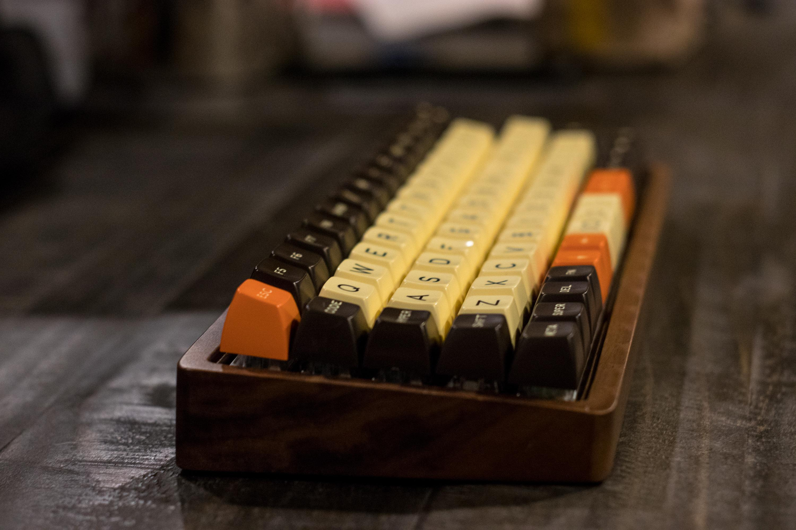
*Набор SA(u) Nuclear Data (источник — [Pimp My Keyboard](https://pimpmykeyboard.com/sa-nuclear-data-keyset/)):*
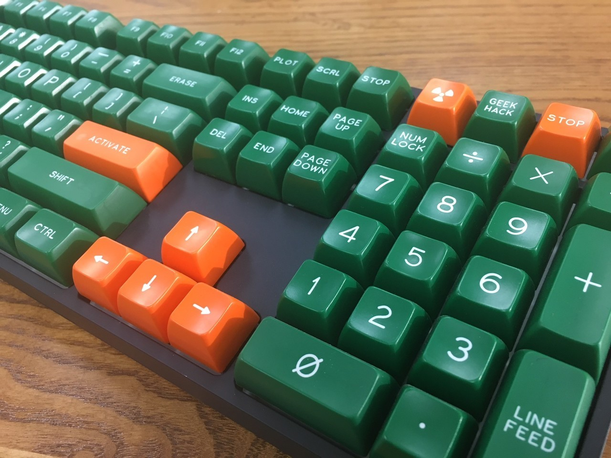

Очень высокие клавиши со сферическим верхом, сделанные по образу и подобию клавиатур старых терминалов. Имеют разные вариации по высотам — все ряды могут быть одной высоты (uniform), а могут быть вогнуты или идти по дуге (sculptured). Изначально их делала компания SP, но сейчас производятся и китайские аналоги, например, Maxkey.

### MT3 Hi-Pro
*Набор MiTo Godspeed в профиль (источник — [Massdrop](https://www.massdrop.com/buy/massdrop-x-mito-mt3-godspeed-custom-keycap-set)):*
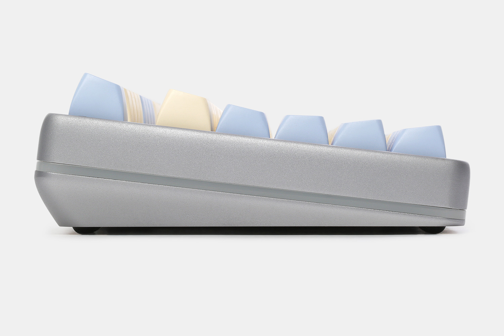
Ещё один профиль, мимикрирующий под старые терминалы. Разработан Matt3o и производится MiTo. Очень схож со Sculptured SA, основное отличие - бо́льшая кривизна, по сравнению со вторым.

### DSA
*Набор DSA Royal Navy (источник — [Reddit](https://www.reddit.com/r/MechanicalKeyboards/comments/4n7fr2/ever_see_a_keycap_set_and_think_damn_i_wish_i_got/)):*
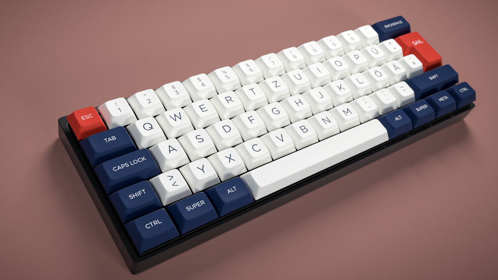

Клавиши с низким профилем, сферической выемкой на верхней грани, единой высотой и уменьшенной площадью поверхности для нажатия. В основном производятся компанией Signature Plastics, но есть и китайские копии.

### DSS
*Набор SP Dolch DSS (источник — [geekhack](https://geekhack.org/index.php?topic=93584)):*

Sculptured-аналог DSA-профиля, практически идентичны Cherry по высоте.

### XDA
*XDA (источник — [Massdrop](https://www.massdrop.com/talk/887/xda-keycaps-a-new-keycap-profile)):*
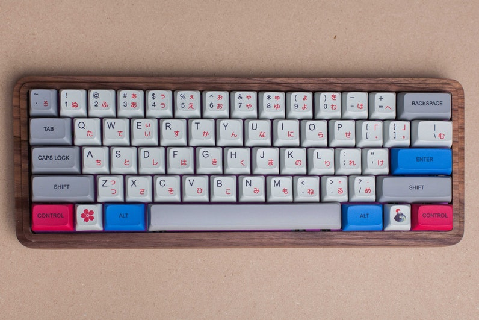
Uniform-кейкапы со сферической верхней частью, более широкой и менее углублённой по сравнению с DSA. Также чуть выше, чем DSA.

### MDA/MIX
*Набор MDA Big Bang (источник — [Kbdfans](https://kbdfans.cn/products/big-bang-mda-profile-ortholinear-keycaps)):*
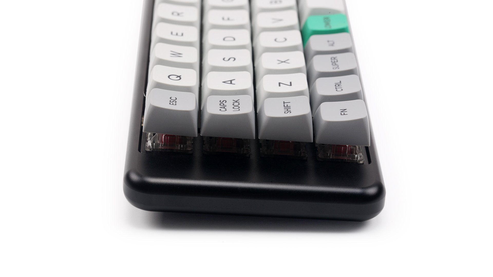

Сферические клавиши с фигурным общим профилем. Похожи на SA уменьшенной высоты, однако имеют немного другой угол наклона, при этом верхняя поверхность кейкапов чуть больше, чем у XDA-профиля.

## Ряды и общий профиль клавиш
Как уже было сказано выше, профиль есть не только у отдельных клавиш, он также присутствует и у всего набора — клавиши, расположенные в разных рядах, отличаются по высоте и форме. Принято разделять все наборы клавиш на две группы: со sculpted(фигурным)-профилем и с uniform(идентичным)-профилем.

Причина существования фигурных профилей заключается в необходимости получить вогнутую поверхность, печатать на которой более удобно, чем на плоской или ступенчатой (stepped profile, как в печатных машинках). В некоторых клавиатурах (IBM Model M/F, Fujitsu FKB4700) клавиши имели одинаковую высоту, но были расположены на вогнутой поверхности. Монтировать MX-совместимые переключатели на изогнутой поверхности технологически сложно, поэтому сейчас в большинстве случаев вогнутая поверхность имитируется формой самих клавиш.

Рассмотрим это на примере современных профилей, таких как OEM или Cherry. Несложно догадаться, что в фигурном профиле клавиши как бы идут ступенькой от верхнего (R1) ряда к нижнему (R4), создавая угол наклона у верхних граней клавиш. Но сейчас самые внимательные из вас зададутся вопросом: почему же на полноразмерной клавиатуре есть целых шесть рядов клавиш, а мы написали про всего лишь четыре? А на самом деле всё очень просто: два верхних ряда идут одинаковыми по высоте, равно как и два нижних, в результате картина принимает подобный вид: R1(Esc)-R1(123)-R2(Q)-R3(A)-R4(Z)-R4(Ctrl). Иногда пробел записывается отдельно от нижнего ряда R4 (Space), так как в некоторых профилях он отличается по форме, высоте и углу наклона от своих соседей по ряду.

В нестандартных профилях, например, SA или MDA, разлиновка по рядам может быть как такой же, так и отличаться. Ну а с uniform-профилем всё гораздо проще: абсолютно все ряды в нём имеют одинаковую высоту клавиш.

Необходимость в uniform-профилях обусловлена широким распространением нестандартных клавиатур (отличающихся от классических ANSI/ISO для PC): POS-клавиатуры, специализированные пульты, самодельные клавиатуры. Да и на стандартной клавиатуре может возникнуть необходимость перестановки клавиш в связи с переходом на альтернативные раскладки (Dvorak, Colemak и т. п.).

Стоит заметить, что под профилем понимается как форма отдельных клавиш, так и их высота, что может вносить определённую путаницу. Это означает, что набор клавиш с профилем SA не всегда подразумевает наличие в нём четырёх различных профилей (R1, R2, R3, R4). Например, в наборе «[SA Ice Cap](https://pimpmykeyboard.com/sa-ice-cap-keyset/)» от SP все клавиши имеют одинаковый профиль третьего ряда (R3), не имеющего наклона. Сделано это ради совместимости с большим количеством клавиатур, в первую очередь — нестандартных ортолинейных. Подавляющее большинство относительно недорогих наборов SA с Aliexpress тоже не являются полностью фигурными. Может использоваться только R3 или R2+R3.

## Методы нанесения символов

### Двойное литьё (doubleshot)
По данной технологии сама клавиша и символы отливаются из двух видов пластика разного цвета. Символы на клавишах с двойным литьём являются самыми износостойкими. Изготавливаются преимущественно из ABS, так как этот пластик имеет более низкую температуру плавления и не деформируется при остывании.

*Образец клавиши с двойным литьём (источник — [Deskthority](https://deskthority.net/wiki/Double-shot_moulding)):*
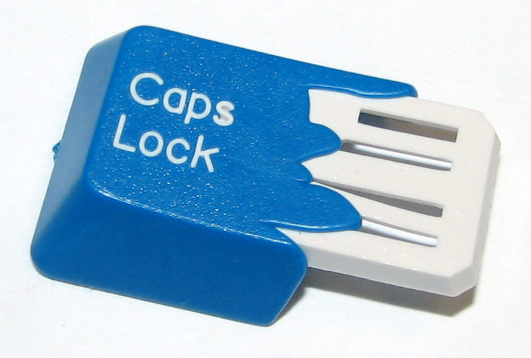

Плюсы:
* Износостойкость
* Контраст и чёткость
* Возможны любые сочетания цветов и материалов (например, полупрозрачный пластик для символов)

Минусы:
* Цена. Качественно выполненные клавиши с двойным литьём стоят от $100 (Maxkey) за стандартный набор и выше.
* Недостаточная гибкость технологии. Изготовление дополнительных форм для литья требует больших инвестиций.
* Чаще всего клавиши с двойным литьём производятся из ABS-пластика, у которого есть свои минусы.

#### Производители
**Signature Plastics** (SP) производят ABS doubleshot'ы и PBT dye-sub'ы в профилях SA, DSA и DCS, а так же PBT dyesub'ы в профиле G20.
**Maxkey** - производит ABS doubleshot'ы. стоят они дешевле чем аналогичные от SP, но пока есть только наборы под стандартную ANSI-раскладку и только из ABS. 
**GMK** — doubleshot'ы с Cherry-профилем, производятся на оригинальном оборудовании Cherry.
**JTK** — doubleshot'ы с Cherry-профилем. Качество заметно хуже чем у GMK, цена значительно меньше. Сейчас в работе находятся кейкапы изготавливаемые по технологии тройного литья (трехцветные кейкапы). 
**MiTo** — dye-sub PBT MT3, XDA, DSA, doubleshot ABS SA.
**Tai-Hao** производит ABS и PBT doubleshot'ы с OEM-профилем и с собственным Cubic (гибрид Cherry и OEM). Стоят относительно недорого, но толщина стенок при этом заметно меньше, чем у GMK. 
**Gateron** делает бланки в Cherry профиле.
Так же стоит отметить **Varmilo** и **Leopold** которые делают кейкапы из PBT (а последний делает качественный PDT doubleshot) в профилях похожих на cherry.

#### Двойное литьё из PBT
PBT-doubleshot'ы уже давно стали реальностью несмотря на все технологические трудности. На Aliexpress они стоят даже дешевле ABS-клавиш от премиум-брендов, но чудес не бывает: помимо традиционных для безымянных производителей проблем с контролем качестве (выравнивание символов, разводы на поверхности) добавляются побочные эффекты, связанные с тугоплавкостью PBT — тонкие элементы символов (например, мелкий шрифт на модификаторах) расплываются, получаются неровными.  
С недавнего времени клавиатуры Leopold стали поставляться с кейкапами изготовленными из PBT пластика по технологии двойного литья.

#### Сверхдешёвые doubleshot'ы
Двойное литьё можно сделать дёшево. Клавиши большинства дешёвых китайских клавиатур с подсветкой выполнены изготовлены методом двойного литья. Отдельно их можно купить за $10-11 на Aliexpress, но за эти деньги вы получите очень тонкие стенки неравномерной толщины с подтёками прозрачного пластика и уродливый шрифт. Сделан он таким с вполне определённой целью — удешевить технологию за счёт отсутствия в символах замкнутых контуров.

#### Coating и гравировка лазером
Это не совсем doubleshot-кейкапы, но по натуре своей они на них очень похожи, так как подразумевают наличие двух слоёв материала. В самых дешёвых клавиатурах с подсветкой (хотя встречаются экземпляры и за 200+$) используются клавиши из полупрозрачного ABS-пластика, поверх которого наносится чёрная краска или какое-нибудь другое покрытие, например, soft-touch. После окрашивания на поверхности кейкапа лазером вырезается дорожка в краске, через которую затем и проходит свет. Износостойкость варьируется от нулевой до низкой — краска в большинстве случаев держится на пластике непрочно и быстро стирается, оставляя вместо символов размазанные их очертания. Сами клавиши по натуре ABS быстро засаливаются и начинают блестеть.

### Сублимационная печатать (dye sublimation)
В данной технологии используются специальные красители, которые переносятся на пластик под воздействием высокой температуры. Краситель при этом проникает в пластик на определённую глубину, что обеспечивает износостойкость.

Плюсы:
* Износостойкость — краситель проникает в пластик на толщину в несколько десятых мм. Сублимационная печать выполняется на PBT-пластике, который отличается механической прочностью.
* Возможна многоцветная печать.
* Высокий контраст в сравнении с лазерным выжиганием.

Минусы:
* Цена. Качественная сублимационная печать (с точным позиционированием и хорошим разрешением) обходится дороже лазера и тампонной печати.
* В большинстве случаев чернила должны быть существенно темнее основы (например, чёрные символы на белых клавишах). Существует технология инверсной сублимационной печати, в которой вся клавиша из светлого пластика покрывается красителем, за исключением маски в виде символа, но визуально такие клавиши заметно уступают в качестве doubleshot'ам.
* Расплывание чернил на границах символов. На качественных клавишах (IBM, ePBT) практически не заметно, в отличие от безымянных клавиш с Aliexpress.

### Лазерная гравировка, лазерное вспенивание/выжигание (laser engraving/etching)
Нанесение символов лазером не требует предварительной подготовки форм, трафаретов и прочего, так что идеально подходит для небольших тиражей. При этом следует различать вспенивание, при котором поверхность пластика нагревается, изменяя цвет и структуру, и гравировку, оставляющую различимую на ощупь канавку.

*Лазерное выжигание против двойного литья. Обратите внимание на контраст (источник — [Deskthority](https://deskthority.net/wiki/Keycap_printing)):*
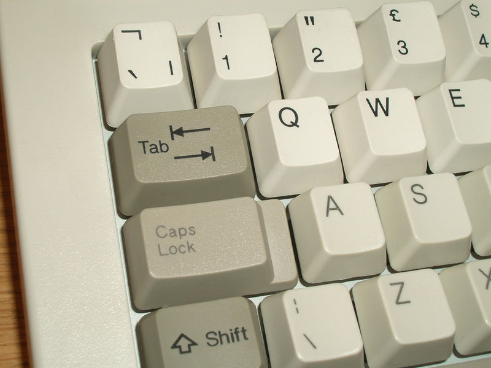

Вспенивание позволяет получить на пластике столь же износостойкий рисунок, как и при сублимационной печати. Недостатком является меньший контраст. При нагревании светлого пластика он темнеет, но близкий к чёрному цвет получить всё равно не удастся.

*Поддельный набор SA Miami Nights с Aliexpress. Из профилей только R2 и R3. Вместо двойного литья используется лазерная гравировка с заполнением (источник — Aliexpress):*
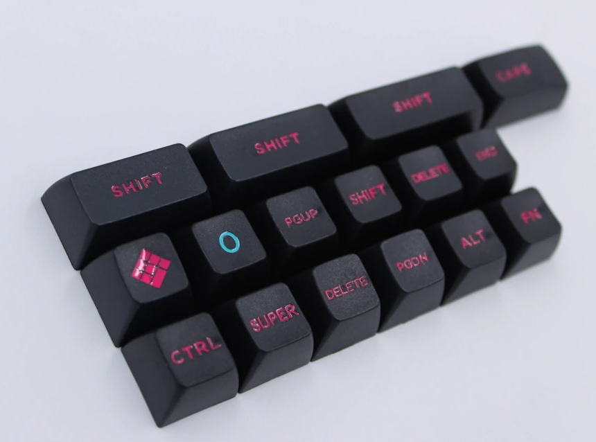

Как и в случае с сублимационной печатью, получение светлых надписей на тёмном пластике требует дополнительных ухищрений. Специальные виды пластика могут менять цвет при обработке лазером за счёт выгорания определённых красителей (используется на некоторых клавиатурах Topre Realforce). Универсальным способом является гравировка. При повышенной мощности лазер оставляет на поверхности пластика канавку, которая затем может быть заполнена краской. Долго такие клавиши с гравировкой не живут. При интенсивном использовании канавки быстро забиваются грязью, а краска стирается.

### Тампонная печать (pad printing)
Самая дешёвая технология для массового производства. Недостаток один — символы сравнительно быстро стираются. Износостойкость сильно зависит от конкретной технологии — клавиша у клавиатуры за $10 при интенсивном использовании сотрётся за год, в более дорогих клавиатурах может применяться краситель на основе эпоксидных смол с дополнительным прочным защитным покрытием, но прочность всё равно будет заметно ниже по сравнению с сублимационной печатью.
