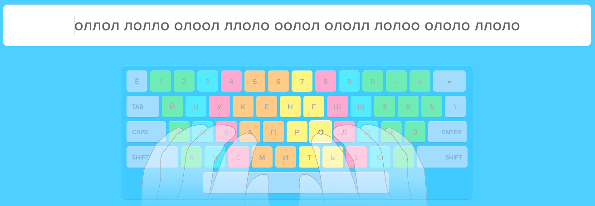

# Осваиваем слепую (и быструю) печать

Если вы увлекаетесь механическими клавиатурами или питаете к ним интерес, то наверняка каждый день работаете с печатью текста или кода и хотели бы ускорить скорость набора. В статье я расскажу, при помощи каких сервисов и упражнений можно это сделать и каких результатов достичь за 3-4 месяца не очень упорных тренировок.

**Дисклеймер**: статья основана на обучении автора на стандартной раскладке ЙЦУКЕН и использовании домашнего ряда ФЫВА ОЛДЖ. Если вы хотите научиться печати вслепую на альтернативных раскладках (WORKMAN, COLEMAK, DVORAK), то, возможно, потребуется спросить совет в нашем чате.

## С чего все начиналось?

Как гласит [Википедия](https://ru.wikipedia.org/wiki/%D0%A1%D0%BB%D0%B5%D0%BF%D0%BE%D0%B9_%D0%BC%D0%B5%D1%82%D0%BE%D0%B4_%D0%BF%D0%B5%D1%87%D0%B0%D1%82%D0%B8), слепой метод печати был разработан в 1888 году стенографистом Франком Эдгаром Макгуррином, который победил на первых соревнованиях по печатанию в Цинциннати. После этого слепому набору стали обучать машининсток и секретарей для того, чтобы увеличить производительность их труда. В СССР также были курсы по обучению слепому набору. Вообще слепой набор из тех времен и печатные машинки тесно связаны с современным миром клавиатур.

## Первый этап. Учимся «правильному» набору.

Как и предполагается из названия на первом этапе будем учиться использовать «все» пальцы для печати, включая мизинцы. Слово «все» выделено в кавычки, так как часто получается так, что один из больших пальцев — правой или левой руки — остается незадействованным. Однако это не утверждение и вы можете использовать оба больших пальца.

Для начала зайдите на [Клавогонки](https://klavogonki.ru/), зарегистрируйтесь, выбирете заезд в режиме «Обычный» и зафиксируйте результат. Это станет отправной точкой в обучении. К самим Клавогонкам вернемся позднее.

Учиться рекомендуем в сервисе [Ratatype](https://www.ratatype.ru/). Перепробовал несколько, но остановился на этом по двум причинам:

* не перегруженный интерфейс;
* нет занудного повторения одних и тех же заданий (может это и действенный метод, но мне так не кажется).

Рецепта как такового нет — регистрируемся, проходим упражнения, как минимум — все упражнения, связанные с буквами, и запоминаем каким пальцем какую клавишу нажимать. Сразу же начните применять изученное на практике. Периодически сверяйтесь — точно ли вы нажимаете нужную клавишу нужным пальцем? Например, распространенная ошибка — буква «И» нажимается указательным пальцем правой руки, а не левой. 

Освойте работу с клавишей shift — ее необходимо нажимать свободной рукой. Предположим, нужно напечатать запятую в русской раскладке. Для этого нажмите клавишу «.,» мизинцем правой руки, а shift — мизинцем левой руки. Это также положительно повлияет на скорость печати.

Кто-то рекомендует распечатать на отдельный лист схему а-ля «Какую клавишу каким пальцем нажимать». Если обучение дается тяжело, то распечатайте и подглядывайте, ничего страшного в этом нет. Главное, в какой-то момент от этого все же отказаться.

На этом этапе важно отказаться от старых привычек при печати и начать использовать при печати мизинцы.

## Второй этап. Закрепляем пройденное и наращиваем скорость.

На этом этапе лично я столкнулся с проблемой — курс пройден, печатаю вслепую и правильно, но очень медленно, так как старые привычки уже ушли, а новые еще не прижились. Поэтому давайте наращивать скорость!

Мне в этом вопросе помог тренажер [KeyKey](https://keykey.ninja/), но он платный и доступен только для MacOS. Если есть возможность использовать его — используйте. Однако я нашел похожий на него — [keybr](https://www.keybr.com/). Суть тренажера в том, что он генерирует слова (которые не всегда возможно прочесть) с использованием определенных букв, постепенно увеличивая сложность.

В моем случае это сработало. После двух часов занятий в выходные я почувствовал, что скорость выросла, ошибок при печати стало меньше, а пальцы будто всегда печатали вслепую. Программа тренажера не большая, так что посвящаем этому по 20 минут каждый вечер в течение пары недель и двигаемся дальше. Обязательно зарегистрируйтесь в сервисе, чтобы отслеживать статистику. На этом этапе уже нужно почаще заходить в «Обычный» режим на Клавогонках.

## Третий этап. Начинаем проходить упражнения Хруста.

После тренировок на keybr переходим к [упражнениям Хруста] (http://klavogonki.ru/wiki/%D0%A3%D0%BF%D1%80%D0%B0%D0%B6%D0%BD%D0%B5%D0%BD%D0%B8%D1%8F_%D0%A5%D1%80%D1%83%D1%81%D1%82%D0%B0). Известны они тем, что пользователь под ником HRUST с Клавогонок разработал специальные упражнения для увеличения скорости и снижения количества ошибок путем тренировки определенных буквенных сочетаний. Сохраните упражнения в свой аккаунт в раздел «Словари» и приступайте к тренировкам.

. Я использую этот сервис, чтобы тренироваться во время небольших перерывов на работе. 

## Небольшие выводы

* Тренируйтесь понемногу (от 20 минут в день до часа), но регулярно;
* Заведите себе аккаунты во всех сервисах, используемых для тренировок, для того, чтобы следить за статистикой;
* Обязательно применяйте изученное в повседневных задачах.

## Вместо послесловия

На прохождение всех этапов у меня ушло около четырех месяцев (учитывая перерыв на отпуск) и я уделял этому совсем не много времени. Сейчас моя средняя скорость набора составляет 300 зн./мин. Но у всего должен быть какой-то осмысленный предел. Для себя я решил, что 350 зн./мин. для меня будет достаточно — больше нужно только для рекордов на Клавогонках. Вы можете поставить себе более высокую цель и смело к ней идти.
